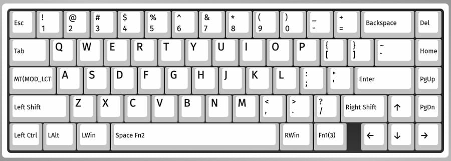
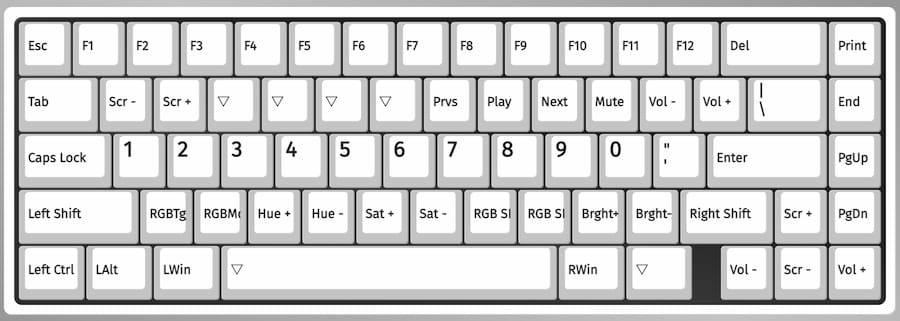
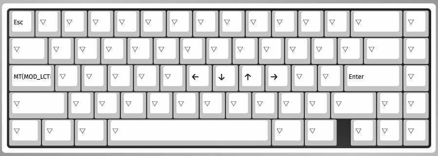

I use a KBD67 Lite R3 (Model KBD67MKIIRGBV3) keyboard. It's a 65% keyboard layout that's hotswappable and comes with USB C. I have GMK CYL Dots 2 Light keycaps, which I enjoy because they're legendless. This means I'm free to experiment with swapping around keys in software and don't have to worry about the physical keycaps not matching. I use HMX Hyacinth linear switches on my stabilized keys and Cherry Browns everywhere else.

I highly recommend picking up a keyboard that is [VIA/QMK compatible](https://www.caniusevia.com). It allows you to use free, open source software to remap your keyboard to your heart's content. The rest of the details (apart from layout) like keycaps, switches, and being hotswappable won't impact your productivity significantly.

My VIA configuration uses 3 layers. [Download link](/files/kbd67.layout.json)

### Layer 0

- <kbd>Caps Lock</kbd> now acts as <kbd>Esc</kbd> when tapped and <kbd>LCtrl</kbd> when held. Here's how you [set up this behaviour with VIA](/10-mod-tap-with-via).
- Swapped <kbd>LWin</kbd> with <kbd>LAlt</kbd>.
- Swapped <kbd>RAlt</kbd> with <kbd>RWin</kbd>.
- <kbd>\ |</kbd> acts as <kbd>` ~</kbd>.
- Swapped <kbd>End</kbd> with <kbd>Delete</kbd> and moved <kbd>Home</kbd> down a row.
- Grouped <kbd>PgUp</kbd> and <kbd>PgDown</kbd> together.
- Change <kbd>Space</kbd> to <kbd>Space Fn2</kbd>, which acts as <kbd>Space</kbd> when tapped and activates `Layer 2` when held.

### Layer 1

This layer is active when <kbd>Fn1</kbd> on `Layer 0` is held down. Notable features:

- Number row replaces home row.
- The shortcuts underneath the Function row are in the same order found on Apple's official keyboards. The 4 empty keys represent `Mission Control`, `Spotlight`, `Dictation`, and `Do Not Disturb` and are missing because there's no equivalent command in VIA.
- The bottom row of the alphas are for controlling the lighting on my keyboard. I typically just turn all lighting off.
- Volume and screen brightness controls are repeated on the arrow keys.

### Layer 2

Active when <kbd>Space</kbd> on `layer 0` is held down. This is a layer specifically for moving the arrow keys to the H, J, K, and L keys. I use it all the time in Finder...
