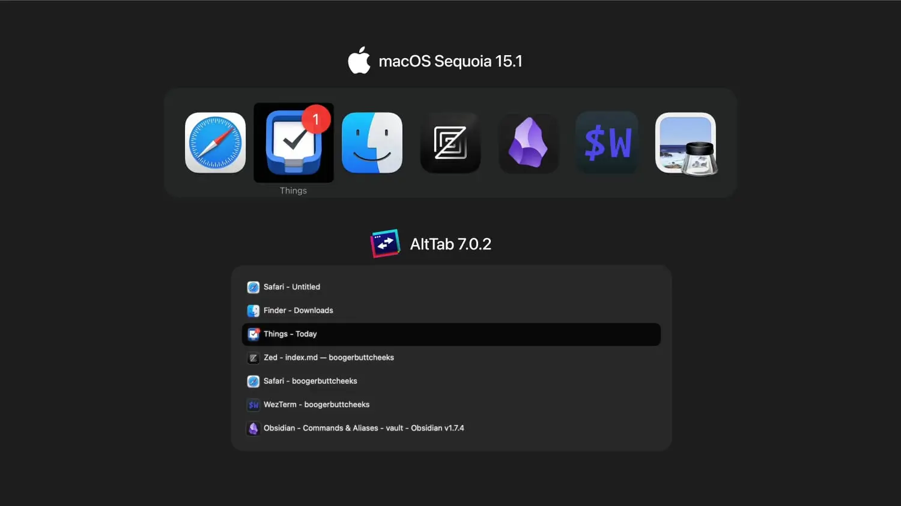

I have an M1 Air, which limits me to one external monitor. I'm also not a fan of Apple's workspaces which have an animation that can't be turned off. With three apps, I finally feel as productive as my multi monitor setups on other operating systems.

The three apps that define my macOS experience are [Raycast](https://raycast.com), [AltTab](https://alt-tab-macos.netlify.app), and [BetterTouchTool (BTT)](https://folivora.ai).

Raycast has a free tier for personal use, while AltTab is free and [open source](https://github.com/lwouis/alt-tab-macos). Meanwhile, a lifetime license to BTT costs $24 USD -- great value, and there's also a generous free trial period, but it ain't free. I recommend all macOS newbies download those first two apps. BTT is different... incredibly versatile, but it's more for power users and not as plug and play as the former two applications.

For AltTab I use the `Titles` appearance setting. My biggest qualm with Apple's implementation is you can't switch to a specific window, only specific apps. Having a list of all my open windows is easier for me to use.

I use Raycast to launch apps and I've been using the built in window manager lately. I had trepidations about leaving [Rectangle](https://rectangleapp.com), but the keyboard shortcuts are 1:1. Zero learning curve.

My most used Raycast commands are clipboard history, color picker, emoji picker, and unicode characters. I don't use a lot of extensions -- my favorite is a [slightly modified](https://github.com/trevortylerlee/date-format-converter) version of Yang XinYu's [Date Format Converter](https://www.raycast.com/yangxy/date-format-converter) extension. I removed the clipboard functionality, so when the command is invoked the extension just presents a list of the current time in multiple formats.

Finally, BTT. There are [limitless possibilities](community.foli), but here are the two shortcuts I use the most. The first is the [right click shortcut](/4-btt-right-click-shortcut) that I've talked about. I use this one most often in Finder -- when an item is selected, I can press <kbd>⌥</kbd> + <kbd>Space</kbd> to trigger the contextual menu for the item.

The second is a group of shortcuts that emulates the feature set of [rcmd](https://lowtechguys.com/rcmd/). I created several keymaps to my most used apps, like:
- **Browser**: <kbd>Right ⌘</kbd> + <kbd>b</kbd>
- **Finder**: <kbd>Right ⌘</kbd> + <kbd>f</kbd>
- **Obsidian**: <kbd>Right ⌘</kbd> + <kbd>o</kbd>
- **Polycapture**: <kbd>Right ⌘</kbd> + <kbd>p</kbd>
- **Terminal**: <kbd>Right ⌘</kbd> + <kbd>Space</kbd>
- **Things 3**: <kbd>Right ⌘</kbd> + <kbd>t</kbd>
- **VS Code**: <kbd>Right ⌘</kbd> + <kbd>c</kbd>
- **Zed**: <kbd>Right ⌘</kbd> + <kbd>z</kbd>

Happy Halloween! 🎃
